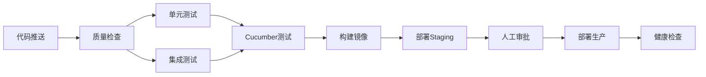

# CI/CD 配置说明

本文档说明项目的 CI/CD 工作流程。

## 📊 工作流概览



## 🔄 触发条件

| 事件 | 分支 | 操作 |
|------|------|------|
| Push | `main`, `develop` | 完整 CI/CD 流程 |
| Pull Request | `main` | CI 检查（不部署） |
| 手动触发 | - | 可以手动触发部署或回滚 |

## 📦 Jobs 说明

### 1. 代码质量检查 (quality)
- 运行 Checkstyle
- 运行 SpotBugs
- 上传检查报告

### 2. 单元测试 (unit-tests)
- 运行所有单元测试 (`*Test`)
- 生成测试覆盖率报告
- 上传到 Codecov

### 3. 集成测试 (integration-tests)
- 运行集成测试 (`*IntegrationTest`)
- 验证组件集成

### 4. Cucumber 测试 (cucumber-tests)
- 运行 BDD 测试场景
- 生成 HTML 和 JSON 报告

### 5. 构建打包 (build)
- 构建 JAR 包
- 跳过测试（已在之前阶段运行）

### 6. Docker 构建 (docker)
- 构建多架构 Docker 镜像
- 推送到 Docker Hub
- 支持缓存优化

### 7. Staging 部署 (deploy-staging)
- 部署到 Staging 环境
- 健康检查
- 冒烟测试
- 通知 Slack

### 8. 人工审批 (manual-approval)
- 等待人工审批
- 通知审批请求

### 9. 生产部署 (deploy-production)
- 蓝绿部署策略
- 自动备份
- 健康检查

### 10. 部署后检查 (post-deploy-check)
- 最终健康检查
- 成功/失败通知

## 🔧 配置 Secrets

在 GitHub 仓库的 Settings → Secrets and variables → Actions 中配置以下 secrets：

| Secret 名称 | 说明 | 必需 |
|------------|------|------|
| `DOCKER_USERNAME` | Docker Hub 用户名 | ✅ |
| `DOCKER_PASSWORD` | Docker Hub 密码/Token | ✅ |
| `STAGING_HOST` | Staging 服务器地址 | ✅ |
| `STAGING_USER` | Staging SSH 用户 | ✅ |
| `STAGING_SSH_KEY` | Staging SSH 私钥 | ✅ |
| `STAGING_DB_URL` | Staging 数据库 URL | ✅ |
| `STAGING_DB_USERNAME` | Staging 数据库用户 | ✅ |
| `STAGING_DB_PASSWORD` | Staging 数据库密码 | ✅ |
| `STAGING_JWT_SECRET` | Staging JWT 密钥 | ✅ |
| `PRODUCTION_HOST` | 生产服务器地址 | ✅ |
| `PRODUCTION_USER` | 生产 SSH 用户 | ✅ |
| `PRODUCTION_SSH_KEY` | 生产 SSH 私钥 | ✅ |
| `PRODUCTION_DB_URL` | 生产数据库 URL | ✅ |
| `PRODUCTION_DB_USERNAME` | 生产数据库用户 | ✅ |
| `PRODUCTION_DB_PASSWORD` | 生产数据库密码 | ✅ |
| `PRODUCTION_JWT_SECRET` | 生产 JWT 密钥 | ✅ |
| `SLACK_WEBHOOK_URL` | Slack Webhook URL | ✅ |

## 🚀 本地开发工作流

### 1. 创建功能分支
```bash
git checkout -b feature/your-feature-name
```

### 2. 开发并测试
```bash
# 格式化代码
mvn spotless:apply

# 运行单元测试
mvn test -Dtest=*Test

# 运行集成测试
mvn test -Dtest=*IntegrationTest

# 运行 Cucumber 测试
mvn test -Dtest=CucumberTestRunner

# 检查覆盖率
mvn jacoco:report
# 查看: target/site/jacoco/index.html
```

### 3. 提交并推送
```bash
git add .
git commit -m "feat: add new feature"
git push origin feature/your-feature-name
```

### 4. 创建 Pull Request
- 在 GitHub 上创建 PR
- 填写 PR 模板
- 等待 CI 检查通过
- 请求代码审查

## 🔍 查看构建状态

- GitHub Actions 页面：`https://github.com/yinghuiwang00/ClaudeCode_ClassSystem/actions`
- 查看测试报告：在 Actions 运行的 Artifacts 中下载

## 🔄 回滚流程

### 手动触发回滚
1. 进入 GitHub Actions 页面
2. 选择 "Rollback Production" 工作流
3. 输入要回滚到的 Commit SHA
4. 输入回滚原因
5. 点击 "Run workflow"

### 自动回滚
如果生产部署后健康检查失败，会自动触发回滚。

## 📊 测试覆盖率目标

| 类型 | 目标 | 当前 |
|------|------|------|
| 单元测试 | > 80% | - |
| 集成测试 | > 70% | - |
| 整体覆盖率 | > 75% | - |

## 📧 故障排查

### 构建失败
1. 查看 Actions 日志
2. 检查失败步骤
3. 修复并推送新提交

### 部署失败
1. 检查服务器连接
2. 验证 secrets 配置
3. 查看服务器日志
4. 触发回滚

### 测试失败
1. 下载测试报告 Artifact
2. 查看失败的测试
3. 本地复现问题
4. 修复并重新测试

## 📚 相关文档

- [项目 README](../README.md)
- [架构文档](../Architecture/ARCHITECTURE.md)
- [测试指南](../TEST_GUIDE/QUICK_START.md)
